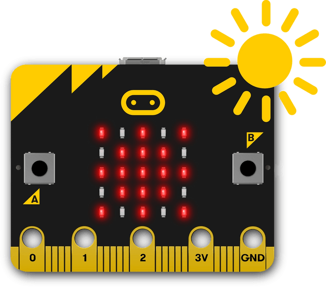

# 🌦️ Bits4Bots Weather Extension


A MakeCode extension for micro:bit to support the **Bits4Bots Weather Station Kit**.

Features:
- Read sensors (Soil moisture, Light, DHT11 Temp/Humidity, BMP280 Temp)
- Display values on a **4-digit TM1637 7-segment display**
- Blocks for individual sensors or automatic cycling


## Sensors Supported
- 🌱 Soil Moisture (P1)
- ☀️ Light Sensor (P2)
- 🌡️ DHT11 Temp/Humidity (P0)
- ⛰️ BMP280 Temp/Pressure (I²C, 0x76)

## Blocks
- **Init 7-seg display CLK DIO**
- **Show number on 7-seg**
- **Show [sensor] on 7-seg**
- **Cycle all sensor values on 7-seg**

## Usage
```blocks
basic.showNumber(Bits4Bots_Weather.soilMoisture())
basic.showNumber(Bits4Bots_Weather.lightLevel())
basic.showNumber(Bits4Bots_Weather.readDHT11(0))
basic.showNumber(Bits4Bots_Weather.bmpTemperature())
B4B_Weather.initDisplay(DigitalPin.P8, DigitalPin.P9)
B4B_Weather.showSensor(B4B_Weather.SensorType.Temp)

Open your microbit makecode project, in Add Package, paste https://github.com/microbit-makecode-packages/TM1637
to search box then search.
```

## Notes
- TM1637 driver is provided here https://github.com/microbit-makecode-packages/TM1637
- Sensor read functions use mock values or micro:bit inputs; connect real modules for actual data.

---
© 2025 Bits4Bots
